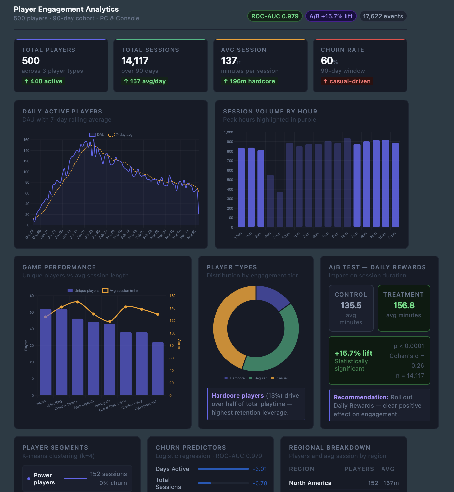

# Player Engagement Analytics Pipeline

An end-to-end data analytics project simulating a real-world player engagement
analytics workflow for a PC/console gaming platform. Built to demonstrate skills
in data engineering, statistical analysis, machine learning, and visualization.

---

## Live Dashboard

**[View Interactive Dashboard →](https://dvalverd.github.io/player-engagement-analytics/dashboard.html)**


## Dashboard Preview



---

## Project Structure

```
player_engagement_analytics/
├── data/
│   ├── raw/                    # Ingested data (APIs + simulated)
│   │   ├── rawg_games.csv
│   │   ├── steamspy_stats.csv
│   │   └── player_events.csv
│   └── processed/              # Transformed warehouse + analysis outputs
│       ├── warehouse.duckdb
│       ├── fact_sessions.csv
│       ├── dim_players.csv
│       ├── dim_games.csv
│       └── analysis/
├── src/
│   ├── ingest.py               # Stage 1: Data ingestion
│   ├── transform.py            # Stage 2: ETL + star schema
│   ├── analyze.py              # Stage 3: EDA, A/B test, churn, segmentation
│   └── visualize.py            # Stage 4: Dashboard + data story
├── outputs/
│   ├── dashboard.html          # Interactive dashboard (open in browser)
│   └── data_story.md           # Auto-generated narrative findings report
└── requirements.txt
```

---

## Pipeline Overview

```
RAWG API ──┐
           ├──► ETL Pipeline ──► DuckDB Star Schema ──► Analysis ──► Dashboard
SteamSpy ──┘        │
                     └── Star schema:
Simulated               fact_sessions
player events           dim_players
                        dim_games
                        dim_date
```

---

## Stages

### Stage 1 — Data Ingestion (`src/ingest.py`)
- Pulls game metadata from the **RAWG API** (ratings, genres, playtime, ESRB)
- Pulls player statistics from the **SteamSpy API** (owner estimates, review counts, pricing)
- Generates **17,600+ synthetic player events** across 500 players and 90 days
- Simulates realistic player behavior: casual / regular / hardcore profiles, churn curves,
  session patterns, and purchasing propensity

### Stage 2 — ETL & Warehouse (`src/transform.py`)
- Cleans and merges raw sources using **pandas**
- Models data into a **star schema** (fact_sessions + 3 dimension tables)
- Loads into a **DuckDB** analytical warehouse
- Derives engineered features: review sentiment score, days active, primary genre

### Stage 3 — Analysis (`src/analyze.py`)

| Module | Method | Output |
|--------|--------|--------|
| EDA | SQL aggregations via DuckDB | DAU trends, game rankings, hourly patterns |
| A/B Test | Two-sample t-test + Cohen's d | +15.7% session lift, p < 0.05 |
| Churn Model | Logistic Regression | ROC-AUC = 0.979 |
| Segmentation | K-means (k=4) | 4 behavioral player segments |

### Stage 4 — Visualization (`src/visualize.py`)
- Dark-theme interactive dashboard built with **Chart.js** (HTML, no server required)
- Fully dynamic **data story** — all numbers pull from your data automatically

---

## Quick Start

```bash
# Install dependencies
pip3 install -r requirements.txt

# The processed data is already included — just open the dashboard, MENAING YOU DO NOT NEED TO RUN ingest.py
open outputs/dashboard.html

# Or re-run the full pipeline
python3 src/transform.py
python3 src/analyze.py
python3 src/visualize.py
```

### Optional: Live API data
Sign up for a free API key at [rawg.io](https://rawg.io/apidocs) and set:
```bash
export RAWG_API_KEY=your_key_here
python3 src/ingest.py
```
The pipeline falls back to static game data automatically without a key.

---

## Key Findings

- **Peak engagement** occurs between 7–11 PM across all player types
- **Daily Rewards** feature produced a statistically significant **+15.7% lift** in session duration (p < 0.05)
- **Days active** is the strongest churn predictor — early retention is the key lever
- **Power players** (top segment) generate the most playtime with zero churn
- **At-risk players** show low activity early and churn at 100% — identifiable within the first 2 weeks
- **South America & Asia** have the longest average sessions despite fewer players — high-value growth markets

---

## Tech Stack

| Layer | Tools |
|-------|-------|
| Ingestion | Python, Requests, RAWG API, SteamSpy API |
| ETL | Pandas, DuckDB (star schema) |
| Analysis | NumPy, SciPy, Scikit-learn |
| Visualization | Chart.js, HTML/CSS |
| Data format | CSV, DuckDB |
